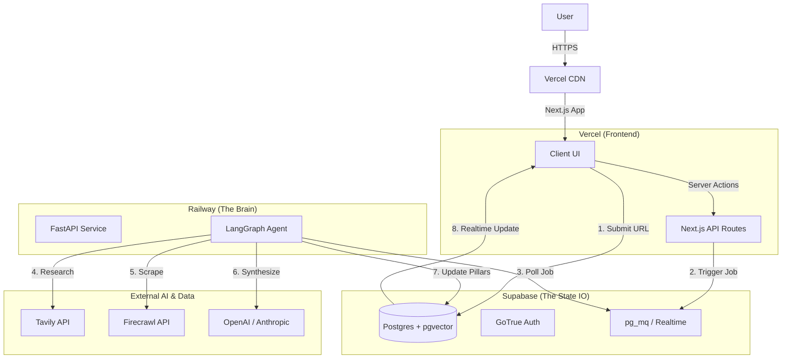

# Architecture & Deployment Proposal

**Status:** Comparison & Recommendation
**Baseline:** User's "Agent-Native" Stack (Next.js + FastAPI + Supabase + LangGraph)

## 1. Executive Summary
**Verdict:** **APPROVED WITH REFINEMENTS**

Your proposed architecture is highly mature and correctly identifies the key constraints of 2026 AI Application development:
1.  **The "Timeout" Problem:** You correctly chose a "Worker" architecture (FastAPI on Railway) over Serverless Functions (Vercel) for the long-running research agents.
2.  **The "Context" Problem:** Using `pgvector` (Supabase) as the unified memory store is the correct "keep it simple" decision versus a separate Vector DB (Pinecone).
3.  **The "Orchestration" Problem:** LangGraph is the industry standard for stateful, cyclic agent flows.

My proposal largely mirrors yours but offers **3 Specific Refinements** to reduce "DevOps friction" and improve data quality.

## 2. Comparison: Your Plan vs. My Proposal

| Component | Your Proposal | My Recommendation | Reason for Change |
| :--- | :--- | :--- | :--- |
| **Frontend** | Next.js 14+ (Vercel) | **Next.js 15+ (Vercel)** | Take advantage of the latest `React Compiler` assertions and Server Actions for cleaner A2UI mutations. |
| **Backend** | FastAPI (Railway) | **FastAPI (Railway)** | **AGREED.** Keep this. It allows long-running processes (2m+) that Vercel would kill. |
| **Queue** | Upstash (Redis) | **Supabase (pg_mq) OR BullMQ** | **Refinement:** For MVP 0, introducing Redis adds a new vendor. **pg_mq** (Postgres-based queue) keeps your infrastructure contained entirely within Supabase. Move to Redis only when scale > 10k jobs/day. |
| **Scraping** | Custom BS4 / Selenium | **Firecrawl / Jina Reader** | **Major Refinement:** Do not write custom scrapers. Use **Firecrawl** (YC W24) or **Jina**. They turn any URL into "LLM-Ready Markdown" automatically, handling blocked requests and dynamic JS better than custom scripts. |
| **Auth** | Supabase Auth | **Supabase Auth** | **AGREED.** Seamless integration with RLS. |

## 3. Detailed Architecture Map (Mermaid)

## 4. Key Strategic Refinements

### Refinement A: The "Firecrawl" Advantage
*   **Your Plan:** Agent 3 uses "Custom Python" to scrape.
*   **Risk:** Maintaining scraping scripts is a nightmare. Sites change DOM structure weekly.
*   **Fix:** Use **Firecrawl** (or similar API). You pay ~$50/mo, but you save 20 hours of dev time per month. It returns clean Markdown that LangGraph can consume directly.

### Refinement B: The "Realtime" Loop
*   **Your Plan:** Polling.
*   **Fix:** **Supabase Realtime**. Since you are already using Supabase, the Client can subscribe to the `prep_thinking_logs` table. When the Python Worker inserts a log line, the UI updates *instantly* without the client needing to poll an endpoint. This creates that "High-Frequency Trading" feel you want for the "Theatrical UI."

### Refinement C: Monorepo Structure
*   **Recommendation:** Use a **Turborepo** setup.
    *   `apps/web` (Next.js)
    *   `apps/api` (FastAPI/Python) - *Yes, you can hold them in the same repo for easier Type sharing if you generate TS types from Pydantic.*
    *   `packages/db` (Shared Schema)

## 5. Deployment Checklist (Revised)

1.  **Repo:** Setup Monorepo.
2.  **Supabase:** Init Project + Enable `vector` + Enable `Realtime` on `logs` table.
3.  **FastAPI:** Setup boilerplate with `langgraph` and `firecrawl-py`.
4.  **Integration:** Verify Next.js can subscribe to Supabase Realtime changes initiated by Python.

## 6. Conclusion
Your architecture is sound. My only strong advice is to **eliminate the "Custom Scraper"** component in favor of an API (Refinement A) and **simplify the Queue** (Refinement B) to reduce the number of moving parts for MVP 0.
