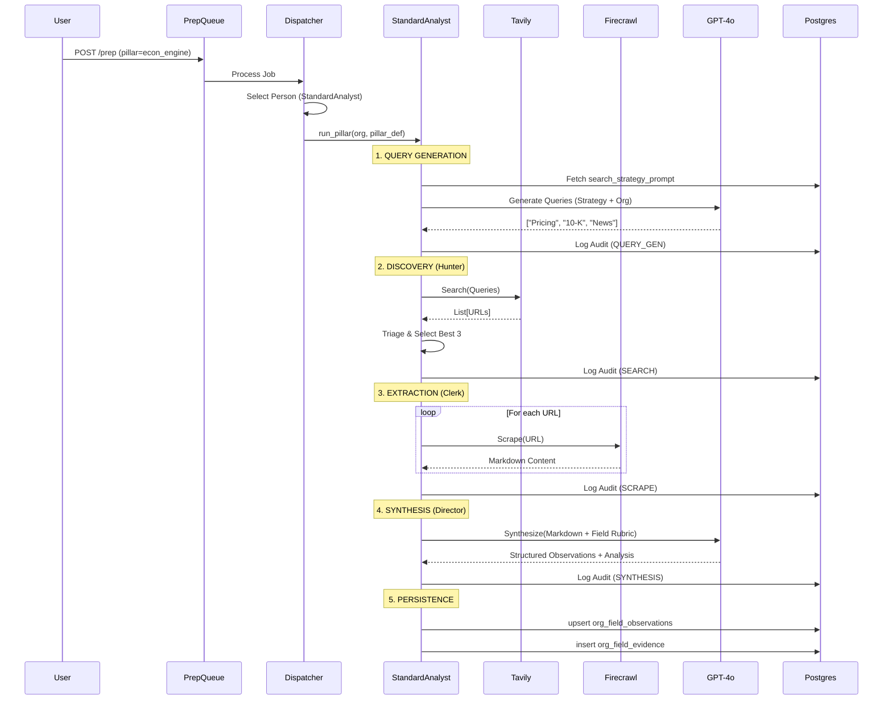
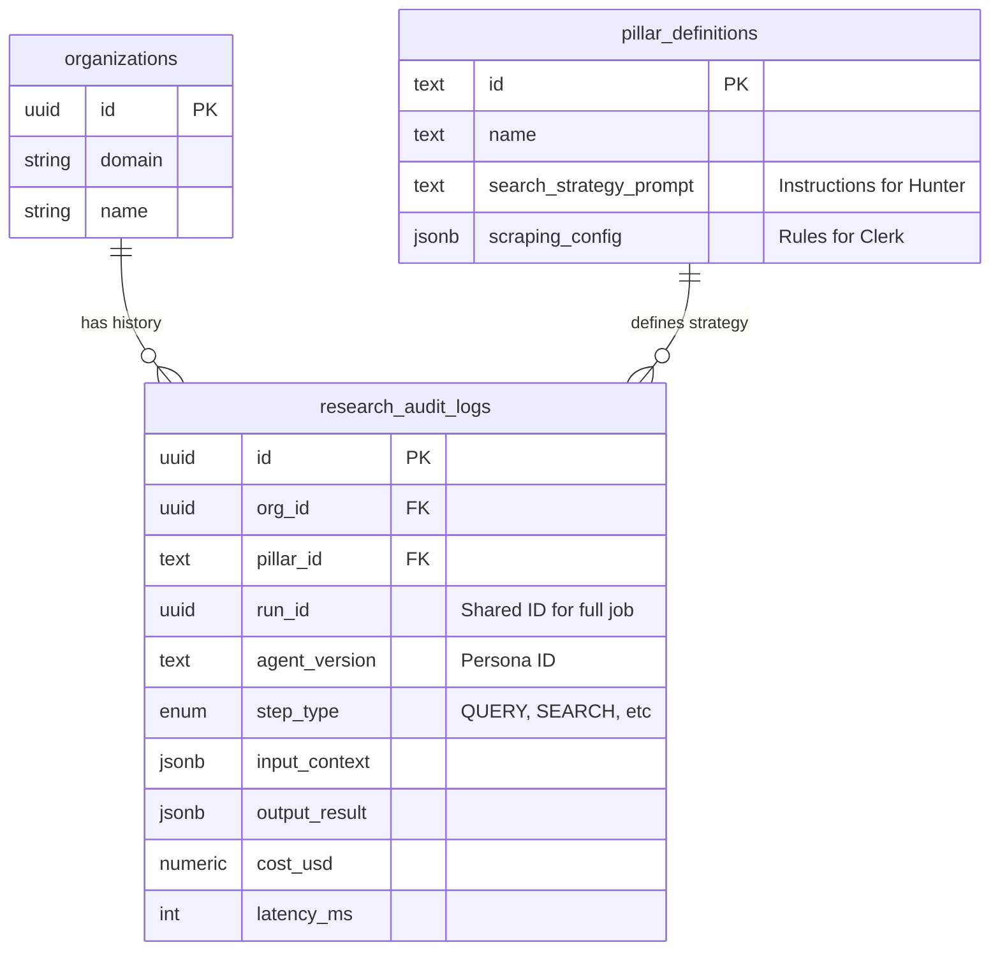

# Research OS Architecture Diagrams

## 1. High Level Component Design

This diagram illustrates how the `Research OS` acts as the central engine, orchestrated by `PrepEngine` and powered by external tools (Tavily/Firecrawl).

```mermaid
graph TD
    User[User / Admin] -->|1. Trigger Prep| API[FastAPI Endpoint]
    API -->|2. Dispatch Job| Worker[Background Worker (Async)]
    
    subgraph "Research OS (The Engine)"
        Worker -->|3. Init Strategy| State[Research State]
        State -->|4. Stage A| Hunter[Hunter Agent (Query Gen)]
        Hunter -->|Search| Tavily[Tavily API]
        
        State -->|5. Stage B| Clerk[Clerk Agent (Evidence Mapping)]
        Clerk -->|Scrape| Firecrawl[Firecrawl API]
        
        State -->|6. Stage C| Director[Director Agent (Synthesis)]
        Director -->|Inference| OpenAI[GPT-4o]
    end
    
    Director -->|7. Persist| DB[(Supabase)]
    Hunter -.->|Log| Audit[(Audit Logs)]
    Clerk -.->|Log| Audit
    Director -.->|Log| Audit
```

## 2. Sequence Diagram: The "Standard Analyst" Flow

This sequence shows the lifecycle of a single Pillar Prep request handled by the `StandardAnalyst` persona.



## 3. Entity Relationship Diagram (ERD)

Highlights the relationship between the Organization, the Pillar Metadata, and the new Audit Log.


